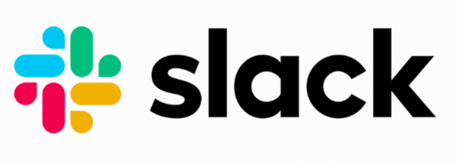

# NOTE: This documentation section will remain only in this branch of the forked repository and will not be added to [main repository](https://github.com/asyncapi/community) without discussing it with the maintainers.


Table of contents
=================

- [Introduction](#introduction)
- [How I approached it?](#how-i-approached-it)
- [How to find YouTube ID?](#how-to-find-youtube-id)
  - [List of different types of YouTube links](#list-of-different-types-of-youtube-links)
- [How to use the action?](#how-to-use-the-action)
  - [Setup the secrets](#setup-the-secrets)
  - [After setting-up secrets, follow this section](#after-setting-up-secrets-follow-this-section)
- [How you can test this](#how-you-can-test-this)
  - [NOTE ON VIDEO IDs](#note-on-video-ids)
- [Test cases](#test-cases)
- [Branch which contains these changes](#branch-which-contains-these-changes)
- [Points to note](#points-to-note)
- [Ending notes](#ending-notes)


# Introduction

- First of all, I've FINALLY resolved this issue https://github.com/asyncapi/community/issues/621 after various obstacles.
- [This is the first file](https://podcasters.spotify.com/pod/show/animeshkumar923/episodes/demo-audio-3-e2704o9) which was using the youtube-to-anchorFM action.
- This was not an easy task for me, like seriously! This was an untouched and unfamiliar topic for me (CI/CD). Was a little scared as how to approach it but the [official documentation](https://github.com/marketplace/actions/upload-episode-from-youtube-to-anchor-fm#how-it-works) helped a lot (~80% was clear from there, thanks to the folks who wrote it).

# How I approached it?

- 1st step was to read the official documentation.
- Going through each step carefully and following the documentation along.
- Made an account on [Anchor.fm, now Spotify Podcast](https://podcasters.spotify.com) (which is now owned by Spotify)
- Uploaded an initial recording as it requires at-least one previous upload to work well.
- Tried setting it up locally but failed. The error was a timeout which I couldn't figure out due to limited knowledge of the codebase of the action.
- After that analyzed some already existing actions and how they work. Asked chatGPT about what are the components of a GitHub action. The full chat can be found [here](https://chat.openai.com/share/ff59536b-47da-4a8a-9f17-c876c84f0f0c) if someone is interested in checking it out.
- After getting some hints, I thought about trying different approaches.
- Identified the unnecessary files by analyzing the existing actions and their different dependencies. 
Deleted them to reduce storage issue and only keep required files.
- Then added the 'deleted and optimized folder' to the `.github/workflows/` folder.
- Gave multiple attempts to create `.yml` file and got it after sometime.
- Tested it by adding the `video ID` to the `episode.json` file.
- Tested 3 cases and got it right.
- Really happy that I got this running. :)

---
---

# How to find YouTube ID?

Let's take this video for example with link: https://youtu.be/3rg_7hIb9PQ

Here the video ID is the word after `https://youtu.be/`, i.e., `3rg_7hIb9PQ`

## List of different types of YouTube links

- `https://www.youtube.com/watch?v=VIDEO_ID`
  - Here, it can be https://www.youtube.com/watch?v=3rg_7hIb9PQ
- `https://youtu.be/VIDEO_ID`
  - Here, it can be https://www.youtu.be/3rg_7hIb9PQ
- `https://www.youtube.com/embed/VIDEO_ID`
  - Here, it can be https://www.youtube.com/embed/3rg_7hIb9PQ
- `https://www.youtube.com/playlist?list=PLAYLIST_ID`
  - Here, it can be https://www.youtube.com/playlist?list=PLbi1gRlP7piiaD67o1F4EOPoZztg2r8l6
- `https://www.youtube.com/shorts/VIDEO_ID`
  - Here, it can be https://www.youtube.com/shorts/3rg_7hIb9PQ
- `https://www.youtube.com/watch?v=VIDEO_ID&list=PLAYLIST_ID`
  - Here, it can be https://www.youtube.com/watch?v=deLUAobdVpw&list=PLbi1gRlP7piiaD67o1F4EOPoZztg2r8l6
- `https://youtube.com/shorts/VIDEO_ID?feature=share`
  - Here, it can be https://youtube.com/shorts/U5jUr8XAF_M?feature=share

*If you find more formats, please add to this list by raising an issue and with a follow-up Pull Request (PR)*

# How to use the action?

## Setup the secrets

- **In [my repository](https://github.com/AnimeshKumar923/asyncapi-community/tree/youtube-to-anchor-workflow) on `youtube-to-anchor-workflow` branch, the secrets are already setup so you can skip the [secrets section](#setup-the-secrets) and jump directly to [here](#after-setting-up-secrets-follow-this-section)**

- **This step requires you to have a [Spotify Podcast](https://podcasters.spotify.com) Account. If you don't have, you can create one [here](https://podcasters.spotify.com/getstarted/new)**
  - You can select `I want to create a podcast and follow the instructions ahead.

- If you've forked the repository, go to that.
- After that -> settings -> select `secrets and variables` -> `Actions` from drop-down menu -> Click on `New repository secret` button.
- In the `Name` field enter `ANCHOR_EMAIL`.
- In the `Secret` field enter your `email` that is used on AnchorFM/Spotify Podcast.
- Now, Add another secret by click on `New repository secret` button.
- In the `Name` field enter `ANCHOR_PASSWORD`.
- In the `Secret` field enter your `password` that is used on AnchorFM/Spotify Podcast. (don't worry, it will be private.)


## After setting-up secrets, follow this section

- For every video, for now I guess, you have to provide the YouTube ID in the `episode.json` file which is in the root folder of repository.
- Then you've to commit and push the changes to the master of asyncapi/community repository.
- After successful completion of the `action`, the podcast goes into draft/unpublished state.
- After trying out 3 attempts of this change, I've observed that the video goes into draft/unpublished state which is a good way to review the changes and update the metadata of the podcast episode.
- After that, the maintainers can attend to those episode and update the information required.

# How you can test this?

If you want to test this, you can follow these steps:

- Go to [this repository](https://github.com/AnimeshKumar923/asyncapi-community/tree/youtube-to-anchor-workflow).
- Fork that repository using the button somewhere on top of the page.
- Create a local branch in your own repository.
- Change your current branch to your local branch if it is not already on it.
- Change the [episode.json file](https://github.com/AnimeshKumar923/asyncapi-community/blob/youtube-to-anchor-workflow/episode.json) with your desired video ID. [How to find Youtube ID?](#how-to-find-youtube-id)
- Commit your changes to the `your-local-branch` branch.
- You can simply do it from the GitHub UI itself. 
  - If you're doing it locally within terminal, make sure to push it on the `your-local-branch` by executing `git push origin your-local-branch`.
- Raise a PR to merge your code/video ID from `your-local-branch` to `youtube-to-anchor-workflow` branch.
- After successful merging the branch, the action will be executed. It may take some time because it build the environment, so please have patience.
- After that you can go to [this Podcast link](https://podcasters.spotify.com/pod/show/animeshkumar923) or [this Spotify link](https://open.spotify.com/show/1o6QPcllwCl5J67R9BjHkF) to check the upload. 
  - It may have the title `Untitled`. The last file I checked and uploaded was `demo audio #5` Check commits for more details.

## NOTE ON VIDEO IDs

- You can raise a PR if your're changing video ID update
- Please avoid songs ID as copyright issues can arise.
- Only add such videos which you think may not be already there on Spotify.

# Test cases

1. [First test case](https://github.com/AnimeshKumar923/asyncapi-community/actions/runs/5564932458/jobs/10164874511)
2. [Second test case](https://github.com/AnimeshKumar923/asyncapi-community/actions/runs/5564988895/jobs/10164983690)
3. [Third test case](https://github.com/AnimeshKumar923/asyncapi-community/actions/runs/5564988895/jobs/10164983690)

`Please update the test cases here if your episode was successfully uploaded on AnchorFM/Spotify Podcast either by raising an issue and a follow-up PR or create an issue and ping me to add the test case.`

# Branch which contains these changes

https://github.com/AnimeshKumar923/asyncapi-community/tree/youtube-to-anchor-workflow

# Points to note

```yml
name: 'Upload Episode from YouTube To Anchor.Fm'

on:
  push:
    paths:
      - episode.json
    branches:
      - master
      - youtube-to-anchor-workflow

jobs:
  upload_episode:
    runs-on: ubuntu-latest
    steps:
      - uses: actions/checkout@v2
      - name: Upload Episode from YouTube To Anchor.Fm
        uses: Schrodinger-Hat/youtube-to-anchorfm@v2.0.0
        env:
          ANCHOR_EMAIL: ${{ secrets.ANCHOR_EMAIL }}
          ANCHOR_PASSWORD: ${{ secrets.ANCHOR_PASSWORD }}
          EPISODE_PATH: /github/workspace
          URL_IN_DESCRIPTION: true
          # POSTPROCESSOR_ARGS: 'ffmpeg:-ac 1'
          # SAVE_AS_DRAFT: true
``` 
---

```yml
        on:
        push:
          paths:
            - episode.json
          branches:
            - master
            - youtube-to-anchor-workflow
```
- `branches` can be updated/removed to only specify the master branch. Currently set to accept from the two branches, i.e, `master` and `youtube-to-anchor-workflow`


# Ending notes

- This note is 100% organic &copy &reg &trade @AnimeshKumar923 
(i.e., I've written all these documentations line-by-line with careful and thorough consideration, and thinking. It's my first time writing such long documentation so there may be things which I'm lacking hence, your feedback is very much required and appreciated.)
- Now make me a CI/CD engineer already. :stuck_out_tongue_winking_eye:   


---
---


<br>
 
 [](https://www.asyncapi.com)

<h4 align="left">Building the future of event-driven architectures</h4>
<h6 align="left">We're on a mission to standardize message-based communication and increase interoperability of the different systems out there.</h6>
<p align="left">
  <a href="https://www.github.com/asyncapi/spec">Specification</a>
  |
  <a href="https://studio.asyncapi.com/">Studio</a>
  |
  <a href="https://www.asyncapi.com/roadmap">Roadmap</a>
  |
  <a href="./CONTRIBUTING.md">Contributing</a>
  |
  <a href="https://www.asyncapi.com/slack-invite">Slack</a>
  |
  <a href="https://www.youtube.com/channel/UCIz9zGwDLbrYQcDKVXdOstQ">Youtube</a>
  |
  <a href="https://opencollective.com/asyncapi">Donate 🙌🏾</a>
</p>

## 💰 Platinum sponsors
<p align="left">
  <a href="https://iqvia.com">
    
  </a>
  &nbsp;&nbsp;&nbsp;&nbsp;
  <a href="https://mulesoft.com">
    
  </a>
  &nbsp;&nbsp;&nbsp;&nbsp;
  <a href="https://salesforce.com">
    
  </a>
  &nbsp;&nbsp;&nbsp;&nbsp;
  <a href="https://sap.com">
    
  </a>
  &nbsp;
  <a href="https://slack.com">
    
  </a>
  &nbsp;
  <a href="https://solace.com">
    
  </a>
  &nbsp;
  <a href="https://tibco.com">
    
  </a>
</p>

<p align="left">
  🙌🏾 <a href="https://opencollective.com/asyncapi">Become a sponsor</a> 🙌🏾
</p>

## 🤗 AsyncAPI meetings
AsyncAPI hosts different meetings every week. Each meeting focuses on different topics; sometimes purely technical, community building, and more. Pick one and join us! [Learn more about our meetings.](https://www.asyncapi.com/community/meetings)

To learn more about meetings setup and automation, [read our FAQ](https://github.com/asyncapi/community/blob/master/MEETINGS_ORGANIZATION.md)


## Contributors

Thanks goes to these wonderful people ([emoji key](https://allcontributors.org/docs/en/emoji-key)):

<!-- ALL-CONTRIBUTORS-LIST:START - Do not remove or modify this section -->
<!-- prettier-ignore-start -->
<!-- markdownlint-disable -->
<table>
  <tbody>
    <tr>
      <td align="center" valign="top" width="14.28%"><a href="http://resume.github.io/?derberg"><br /><sub><b>Lukasz Gornicki</b></sub></a><br /><a href="https://github.com/asyncapi/community/commits?author=derberg" title="Documentation">📖</a> <a href="#ideas-derberg" title="Ideas, Planning, & Feedback">🤔</a> <a href="https://github.com/asyncapi/community/pulls?q=is%3Apr+reviewed-by%3Aderberg" title="Reviewed Pull Requests">👀</a> <a href="https://github.com/asyncapi/community/commits?author=derberg" title="Code">💻</a> <a href="#question-derberg" title="Answering Questions">💬</a> <a href="#eventOrganizing-derberg" title="Event Organizing">📋</a> <a href="#content-derberg" title="Content">🖋</a> <a href="#blog-derberg" title="Blogposts">📝</a> <a href="#tool-derberg" title="Tools">🔧</a> <a href="#talk-derberg" title="Talks">📢</a> <a href="#maintenance-derberg" title="Maintenance">🚧</a> <a href="https://github.com/asyncapi/community/commits?author=derberg" title="Tests">⚠️</a></td>
      <td align="center" valign="top" width="14.28%"><a href="http://mermade.github.io"><br /><sub><b>Mike Ralphson</b></sub></a><br /><a href="#question-MikeRalphson" title="Answering Questions">💬</a> <a href="https://github.com/asyncapi/community/commits?author=MikeRalphson" title="Documentation">📖</a> <a href="https://github.com/asyncapi/community/commits?author=MikeRalphson" title="Code">💻</a> <a href="#ideas-MikeRalphson" title="Ideas, Planning, & Feedback">🤔</a> <a href="#infra-MikeRalphson" title="Infrastructure (Hosting, Build-Tools, etc)">🚇</a> <a href="https://github.com/asyncapi/community/pulls?q=is%3Apr+reviewed-by%3AMikeRalphson" title="Reviewed Pull Requests">👀</a> <a href="https://github.com/asyncapi/community/commits?author=MikeRalphson" title="Tests">⚠️</a> <a href="#tool-MikeRalphson" title="Tools">🔧</a> <a href="#maintenance-MikeRalphson" title="Maintenance">🚧</a> <a href="#eventOrganizing-MikeRalphson" title="Event Organizing">📋</a></td>
      <td align="center" valign="top" width="14.28%"><a href="https://github.com/rmelian"><br /><sub><b>raisel melian</b></sub></a><br /><a href="#question-rmelian" title="Answering Questions">💬</a> <a href="https://github.com/asyncapi/community/issues?q=author%3Armelian" title="Bug reports">🐛</a> <a href="https://github.com/asyncapi/community/commits?author=rmelian" title="Code">💻</a> <a href="https://github.com/asyncapi/community/commits?author=rmelian" title="Documentation">📖</a> <a href="#ideas-rmelian" title="Ideas, Planning, & Feedback">🤔</a> <a href="#maintenance-rmelian" title="Maintenance">🚧</a> <a href="https://github.com/asyncapi/community/pulls?q=is%3Apr+reviewed-by%3Armelian" title="Reviewed Pull Requests">👀</a> <a href="#tool-rmelian" title="Tools">🔧</a> <a href="https://github.com/asyncapi/community/commits?author=rmelian" title="Tests">⚠️</a></td>
      <td align="center" valign="top" width="14.28%"><a href="http://www.fmvilas.com"><br /><sub><b>Fran Méndez</b></sub></a><br /><a href="#question-fmvilas" title="Answering Questions">💬</a> <a href="https://github.com/asyncapi/community/issues?q=author%3Afmvilas" title="Bug reports">🐛</a> <a href="#blog-fmvilas" title="Blogposts">📝</a> <a href="#business-fmvilas" title="Business development">💼</a> <a href="https://github.com/asyncapi/community/commits?author=fmvilas" title="Code">💻</a> <a href="#content-fmvilas" title="Content">🖋</a> <a href="https://github.com/asyncapi/community/commits?author=fmvilas" title="Documentation">📖</a> <a href="#design-fmvilas" title="Design">🎨</a> <a href="#financial-fmvilas" title="Financial">💵</a> <a href="#fundingFinding-fmvilas" title="Funding Finding">🔍</a> <a href="#ideas-fmvilas" title="Ideas, Planning, & Feedback">🤔</a> <a href="#infra-fmvilas" title="Infrastructure (Hosting, Build-Tools, etc)">🚇</a> <a href="#maintenance-fmvilas" title="Maintenance">🚧</a> <a href="#plugin-fmvilas" title="Plugin/utility libraries">🔌</a> <a href="https://github.com/asyncapi/community/pulls?q=is%3Apr+reviewed-by%3Afmvilas" title="Reviewed Pull Requests">👀</a> <a href="#tool-fmvilas" title="Tools">🔧</a> <a href="https://github.com/asyncapi/community/commits?author=fmvilas" title="Tests">⚠️</a> <a href="#tutorial-fmvilas" title="Tutorials">✅</a> <a href="#talk-fmvilas" title="Talks">📢</a> <a href="#eventOrganizing-fmvilas" title="Event Organizing">📋</a></td>
      <td align="center" valign="top" width="14.28%"><a href="https://github.com/DulceDeLaRosa"><br /><sub><b>dulce</b></sub></a><br /><a href="#design-DulceDeLaRosa" title="Design">🎨</a></td>
      <td align="center" valign="top" width="14.28%"><a href="https://github.com/SensibleWood"><br /><sub><b>Chris Wood</b></sub></a><br /><a href="https://github.com/asyncapi/community/commits?author=SensibleWood" title="Code">💻</a> <a href="#ideas-SensibleWood" title="Ideas, Planning, & Feedback">🤔</a> <a href="https://github.com/asyncapi/community/commits?author=SensibleWood" title="Documentation">📖</a></td>
      <td align="center" valign="top" width="14.28%"><a href="https://github.com/jschabowsky"><br /><sub><b>Jonathan Schabowsky</b></sub></a><br /><a href="https://github.com/asyncapi/community/commits?author=jschabowsky" title="Documentation">📖</a> <a href="#fundingFinding-jschabowsky" title="Funding Finding">🔍</a> <a href="#ideas-jschabowsky" title="Ideas, Planning, & Feedback">🤔</a></td>
    </tr>
    <tr>
      <td align="center" valign="top" width="14.28%"><a href="https://github.com/vromero"><br /><sub><b>Victor Romero</b></sub></a><br /><a href="#ideas-vromero" title="Ideas, Planning, & Feedback">🤔</a> <a href="https://github.com/asyncapi/community/pulls?q=is%3Apr+reviewed-by%3Avromero" title="Reviewed Pull Requests">👀</a></td>
      <td align="center" valign="top" width="14.28%"><a href="http://antoniogarrote.wordpress.com"><br /><sub><b>Antonio Garrote</b></sub></a><br /><a href="#ideas-antoniogarrote" title="Ideas, Planning, & Feedback">🤔</a> <a href="https://github.com/asyncapi/community/pulls?q=is%3Apr+reviewed-by%3Aantoniogarrote" title="Reviewed Pull Requests">👀</a></td>
      <td align="center" valign="top" width="14.28%"><a href="https://ramses.tech"><br /><sub><b>Jonathan Stoikovitch</b></sub></a><br /><a href="#fundingFinding-jstoiko" title="Funding Finding">🔍</a> <a href="#example-jstoiko" title="Examples">💡</a> <a href="#ideas-jstoiko" title="Ideas, Planning, & Feedback">🤔</a> <a href="https://github.com/asyncapi/community/pulls?q=is%3Apr+reviewed-by%3Ajstoiko" title="Reviewed Pull Requests">👀</a></td>
      <td align="center" valign="top" width="14.28%"><a href="https://github.com/jonaslagoni"><br /><sub><b>Jonas Lagoni</b></sub></a><br /><a href="https://github.com/asyncapi/community/issues?q=author%3Ajonaslagoni" title="Bug reports">🐛</a> <a href="https://github.com/asyncapi/community/commits?author=jonaslagoni" title="Code">💻</a> <a href="https://github.com/asyncapi/community/commits?author=jonaslagoni" title="Documentation">📖</a> <a href="#ideas-jonaslagoni" title="Ideas, Planning, & Feedback">🤔</a> <a href="#question-jonaslagoni" title="Answering Questions">💬</a> <a href="#eventOrganizing-jonaslagoni" title="Event Organizing">📋</a></td>
      <td align="center" valign="top" width="14.28%"><a href="http://evamorcillo.com/"><br /><sub><b>Eva</b></sub></a><br /><a href="#ideas-evamorcillo" title="Ideas, Planning, & Feedback">🤔</a> <a href="#business-evamorcillo" title="Business development">💼</a> <a href="#eventOrganizing-evamorcillo" title="Event Organizing">📋</a></td>
      <td align="center" valign="top" width="14.28%"><a href="https://waleedashraf.me/"><br /><sub><b>Waleed Ashraf</b></sub></a><br /><a href="#talk-WaleedAshraf" title="Talks">📢</a> <a href="#tool-WaleedAshraf" title="Tools">🔧</a> <a href="#eventOrganizing-WaleedAshraf" title="Event Organizing">📋</a></td>
      <td align="center" valign="top" width="14.28%"><a href="https://github.com/jerzyn"><br /><sub><b>Andrzej Jarzyna</b></sub></a><br /><a href="#talk-jerzyn" title="Talks">📢</a> <a href="#eventOrganizing-jerzyn" title="Event Organizing">📋</a></td>
    </tr>
    <tr>
      <td align="center" valign="top" width="14.28%"><a href="https://linkedin.com/in/emmelyn"><br /><sub><b>Emmelyn Wang</b></sub></a><br /><a href="#blog-lifewingmate" title="Blogposts">📝</a> <a href="#eventOrganizing-lifewingmate" title="Event Organizing">📋</a> <a href="#ideas-lifewingmate" title="Ideas, Planning, & Feedback">🤔</a> <a href="https://github.com/asyncapi/community/commits?author=lifewingmate" title="Documentation">📖</a> <a href="#talk-lifewingmate" title="Talks">📢</a></td>
      <td align="center" valign="top" width="14.28%"><a href="https://marcd.dev"><br /><sub><b>Marc DiPasquale</b></sub></a><br /><a href="#blog-Mrc0113" title="Blogposts">📝</a> <a href="#talk-Mrc0113" title="Talks">📢</a> <a href="https://github.com/asyncapi/community/pulls?q=is%3Apr+reviewed-by%3AMrc0113" title="Reviewed Pull Requests">👀</a> <a href="https://github.com/asyncapi/community/issues?q=author%3AMrc0113" title="Bug reports">🐛</a> <a href="#ideas-Mrc0113" title="Ideas, Planning, & Feedback">🤔</a> <a href="#video-Mrc0113" title="Videos">📹</a></td>
      <td align="center" valign="top" width="14.28%"><a href="http://www.gerald-loeffler.net/"><br /><sub><b>Gerald Loeffler</b></sub></a><br /><a href="https://github.com/asyncapi/community/commits?author=GeraldLoeffler" title="Documentation">📖</a> <a href="https://github.com/asyncapi/community/issues?q=author%3AGeraldLoeffler" title="Bug reports">🐛</a> <a href="#ideas-GeraldLoeffler" title="Ideas, Planning, & Feedback">🤔</a></td>
      <td align="center" valign="top" width="14.28%"><a href="http://dalelane.co.uk/"><br /><sub><b>Dale Lane</b></sub></a><br /><a href="#blog-dalelane" title="Blogposts">📝</a> <a href="#ideas-dalelane" title="Ideas, Planning, & Feedback">🤔</a> <a href="#video-dalelane" title="Videos">📹</a> <a href="#talk-dalelane" title="Talks">📢</a> <a href="#tutorial-dalelane" title="Tutorials">✅</a> <a href="https://github.com/asyncapi/community/commits?author=dalelane" title="Documentation">📖</a></td>
      <td align="center" valign="top" width="14.28%"><a href="https://github.com/magicmatatjahu"><br /><sub><b>Maciej Urbańczyk</b></sub></a><br /><a href="https://github.com/asyncapi/community/pulls?q=is%3Apr+reviewed-by%3Amagicmatatjahu" title="Reviewed Pull Requests">👀</a> <a href="#ideas-magicmatatjahu" title="Ideas, Planning, & Feedback">🤔</a></td>
      <td align="center" valign="top" width="14.28%"><a href="https://vladimirgorej.com/"><br /><sub><b>Vladimir Gorej</b></sub></a><br /><a href="https://github.com/asyncapi/community/commits?author=char0n" title="Documentation">📖</a></td>
      <td align="center" valign="top" width="14.28%"><a href="http://www.lornajane.net/"><br /><sub><b>Lorna Jane Mitchell</b></sub></a><br /><a href="#talk-lornajane" title="Talks">📢</a> <a href="#ideas-lornajane" title="Ideas, Planning, & Feedback">🤔</a></td>
    </tr>
    <tr>
      <td align="center" valign="top" width="14.28%"><a href="http://medium.com/@lbroudoux"><br /><sub><b>Laurent Broudoux</b></sub></a><br /><a href="https://github.com/asyncapi/community/commits?author=lbroudoux" title="Code">💻</a> <a href="https://github.com/asyncapi/community/commits?author=lbroudoux" title="Documentation">📖</a> <a href="#blog-lbroudoux" title="Blogposts">📝</a> <a href="#talk-lbroudoux" title="Talks">📢</a> <a href="#example-lbroudoux" title="Examples">💡</a> <a href="#ideas-lbroudoux" title="Ideas, Planning, & Feedback">🤔</a> <a href="https://github.com/asyncapi/community/pulls?q=is%3Apr+reviewed-by%3Albroudoux" title="Reviewed Pull Requests">👀</a></td>
      <td align="center" valign="top" width="14.28%"><a href="https://github.com/jmenning-solace"><br /><sub><b>Jesse Menning</b></sub></a><br /><a href="#blog-jmenning-solace" title="Blogposts">📝</a> <a href="#talk-jmenning-solace" title="Talks">📢</a> <a href="https://github.com/asyncapi/community/pulls?q=is%3Apr+reviewed-by%3Ajmenning-solace" title="Reviewed Pull Requests">👀</a> <a href="#ideas-jmenning-solace" title="Ideas, Planning, & Feedback">🤔</a></td>
      <td align="center" valign="top" width="14.28%"><a href="https://github.com/Barbanio"><br /><sub><b>Barbanio González</b></sub></a><br /><a href="#blog-Barbanio" title="Blogposts">📝</a></td>
      <td align="center" valign="top" width="14.28%"><a href="https://github.com/Dindihub"><br /><sub><b>Dindihub</b></sub></a><br /><a href="https://github.com/asyncapi/community/commits?author=Dindihub" title="Documentation">📖</a></td>
      <td align="center" valign="top" width="14.28%"><a href="https://bhaswatiroy.github.io/Bhaswati-Roy-Portfolio/"><br /><sub><b>Bhaswati Roy </b></sub></a><br /><a href="https://github.com/asyncapi/community/commits?author=BhaswatiRoy" title="Documentation">📖</a></td>
      <td align="center" valign="top" width="14.28%"><a href="https://github.com/philCryoport"><br /><sub><b>Philip Schlesinger @ Cryoport</b></sub></a><br /><a href="https://github.com/asyncapi/community/commits?author=philCryoport" title="Documentation">📖</a></td>
      <td align="center" valign="top" width="14.28%"><a href="http://blog.ineat-conseil.fr/"><br /><sub><b>Ludovic Dussart</b></sub></a><br /><a href="#talk-M3lkior" title="Talks">📢</a> <a href="https://github.com/asyncapi/community/pulls?q=is%3Apr+reviewed-by%3AM3lkior" title="Reviewed Pull Requests">👀</a> <a href="#ideas-M3lkior" title="Ideas, Planning, & Feedback">🤔</a></td>
    </tr>
    <tr>
      <td align="center" valign="top" width="14.28%"><a href="https://danielkocot.github.io"><br /><sub><b>Daniel Kocot</b></sub></a><br /><a href="#talk-danielkocot" title="Talks">📢</a> <a href="https://github.com/asyncapi/community/pulls?q=is%3Apr+reviewed-by%3Adanielkocot" title="Reviewed Pull Requests">👀</a> <a href="#ideas-danielkocot" title="Ideas, Planning, & Feedback">🤔</a></td>
      <td align="center" valign="top" width="14.28%"><a href="http://twitter.com/hguerreroo"><br /><sub><b>Hugo Guerrero</b></sub></a><br /><a href="#talk-hguerrero" title="Talks">📢</a> <a href="https://github.com/asyncapi/community/pulls?q=is%3Apr+reviewed-by%3Ahguerrero" title="Reviewed Pull Requests">👀</a> <a href="#ideas-hguerrero" title="Ideas, Planning, & Feedback">🤔</a></td>
      <td align="center" valign="top" width="14.28%"><a href="http://www.alejandraquetzalli.com"><br /><sub><b>Alejandra Quetzalli </b></sub></a><br /><a href="#talk-alequetzalli" title="Talks">📢</a> <a href="https://github.com/asyncapi/community/pulls?q=is%3Apr+reviewed-by%3Aalequetzalli" title="Reviewed Pull Requests">👀</a> <a href="#ideas-alequetzalli" title="Ideas, Planning, & Feedback">🤔</a></td>
      <td align="center" valign="top" width="14.28%"><a href="https://www.behance.net/muibudeenaisha"><br /><sub><b>AISHAT MUIBUDEEN</b></sub></a><br /><a href="#design-Mayaleeeee" title="Design">🎨</a></td>
      <td align="center" valign="top" width="14.28%"><a href="http://14richa.github.io"><br /><sub><b>Richa</b></sub></a><br /><a href="#infra-14Richa" title="Infrastructure (Hosting, Build-Tools, etc)">🚇</a></td>
      <td align="center" valign="top" width="14.28%"><a href="https://github.com/princerajpoot20"><br /><sub><b>Prince Rajpoot</b></sub></a><br /><a href="https://github.com/asyncapi/community/commits?author=princerajpoot20" title="Code">💻</a></td>
    </tr>
  </tbody>
</table>

<!-- markdownlint-restore -->
<!-- prettier-ignore-end -->

<!-- ALL-CONTRIBUTORS-LIST:END -->

This project follows the [all-contributors](https://github.com/all-contributors/all-contributors) specification. Contributions of any kind welcome!
